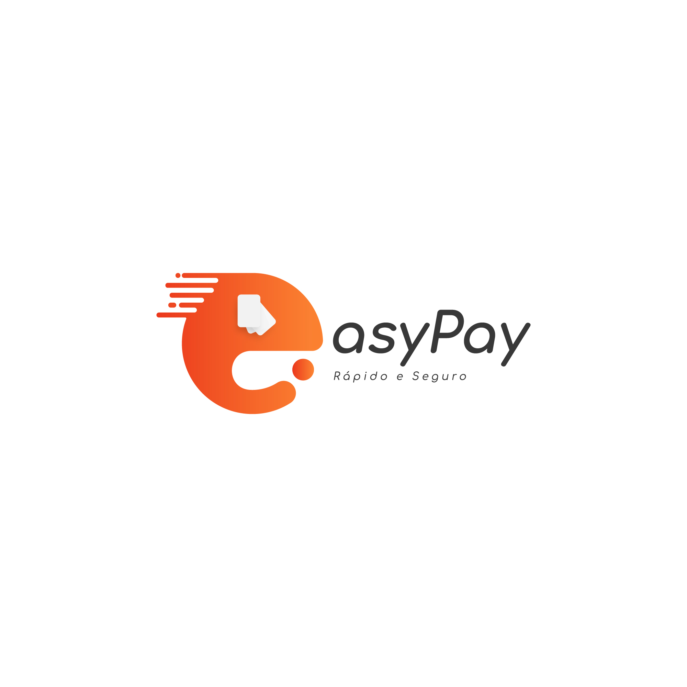

# Easepayment - Pagamento fácil :blush:

**Sobre o projecto** :
`e-pay` ou pagamento facilitado é uma aplicação que tem como finalidade principal facilitar no processo de pagamento entre encarregados e instituição diminuindo assim a demora nesse processo.

**Objectivos Gerais** :
Os objectvos gerais da aplicação é fazer com que ela possa atender toda a demanda que de certa forma dificulta os encarregados a realizar determinadas actividades sem que necessariamente se façam presente a instituição de ensino em causa, abrangir as universidades também.

- Possibilidade em receber empréstimos para poder pagar a instituição, e o empréstimo será a instituição a fazê-lo e em um prazo determinado fazer a devolução dos valores.
- Associar filhos a conta de responsável.
- Poder associar a conta do easepayment as contas bancárias de bancos diversos.
- Verificar o histórico e aproveitamento do estudante.
- Ser notificado de todas as actividades realizadas pela instituição com antesedência, por meio de mensagem escrita.
- Para além de associar as suas contas bancárias possuir uma carteira onde poderá conter o saldo.
- Possibilidade em pagar tudo e mais alguma coisa que a instituição oferece como por exemplo (uniforme, propina, actividades escolares, materiais escolares).
- Realizar pagamento de forma direcionada, para um ou vários educandos que se encontrarm associados a conta pai.
- Gerar uma referência de pagamento e factura de pagamento que em seguida será encaminhada para a instituição.
- Notificação de atraso de pagamento.

Outras funcionalidades que no momento não vêm a minha cabeça serão implementados de acordo ao feedback dos usuários da aplicação.

**Objectivos Específicos** :
Especificamente o que estará functionando já nessa primeira versão da aplicação será.
- Criação de conta responsável.
- Associar a conta aos educandos que monitora ou a sí mesmo caso for responsável de sí mesmo.
- Realização de pagamento de propína, uniforme.
- Carteira onde será descontando os valores.
- Possibilidade de carregar e diminuir o valor da carteira.
- Realizar pagamento de forma direcionada, para um ou vários educandos que se encontrarm associados a conta pai.
- Gerar uma referência de pagamento e factura de pagamento que em seguida será encaminhada para a instituição.
- Notificação de atraso de pagamento.

Especificamente o primeiro módulo da aplicação ou seja versão da aplicação vai realizar todas essas actividades.

## Arquitetura

A arquitetura que será utilizada para desenvolvimento dessa aplicação será a clean arquitetura (Arquitetura limpa), visto que a aplicação tende a crescer e a ideia é colocar total independência na aplicação.

Facilitando assim a possível migração de determinados recursos nela.

## Linguagem backend

Será desenvolvida com `python`

### Diferenciais da aplicação

Algumas actividades serão realizadas em real time, tais como a notificação do atraso de pagamento entre outros.

### Versão de aplicação

Inicializamos o desenvolvimento da aplicação praticamente agora então podemos dizer que estamos na primaira versão.

| Versão |
| ------ |
| 0.1    |

